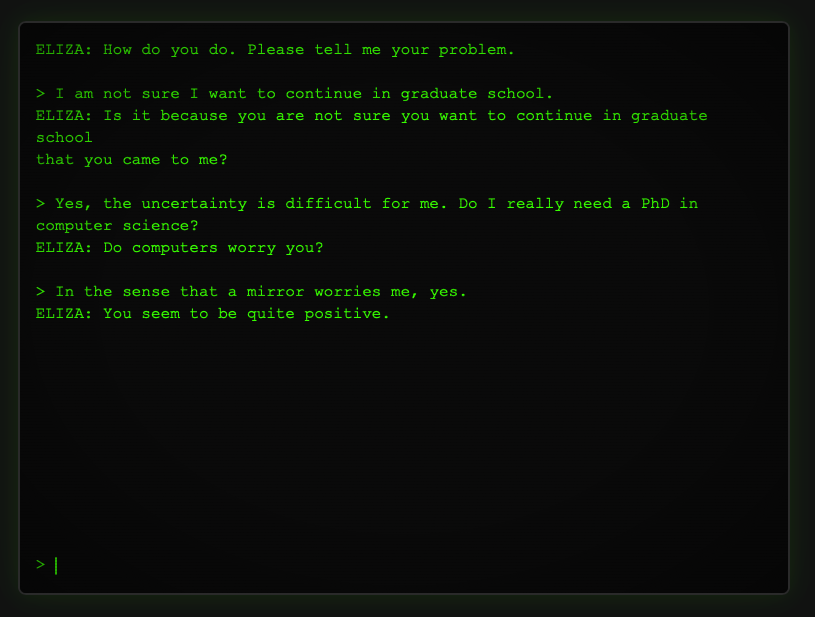

## Know your history.

It is worth knowing a little bit about what you are being sold, what is (as of Apr 2026) one fifth of the United States economy. And the first thing to know is a little bit of context. I will be brutally brief, but I will include sources.[^wiki]

In 1968 a professor of computer science[^eliza] wrote a few lines of code to demonstrate how easy it was to ape our language. In the 1970s, as personal computers started showing up in schools, someone distributed a version written in BASIC. (Keep in mind that there is more computing power in the adapter for your laptop than there was in these early computers.[^power]) Eliza, the program, so convincingly imitated an interested therapist that people crowded around the screens, seeing what she would say next. In the professor’s own office his secretary closed the door so that she could have more privacy while she confided in four hundred lines of programming code.

You should try it, just to see what was happening in 1970. I’ve [tossed it up on a little website](https://eliza.mightycheese.com).[^web-eliza] There are links to how it works and the history of the project. You can see (and download) the source code.

Let’s skip ahead twenty years. We’re at Bell Labs, in the Terminal Room with rob pike, Brian Kernigham, Ken Thompson, and Bruce Ellis. One of them (probably all of them) had read Andrey Markov’s research on language and proposition of Markov Chains.[^markov] With a little bit of fiddling they can feed in some source material[^included-text] and generate the tables that Markov thought were interesting: the frequency of one word occurring after another. Or, to use a very local example, how often does the word ‘another’ follow the word ‘after?’ [^local] 

Look at all the words that start a sentence. Roll a die and pick one (‘Look’) and grab all the words which might follow it. They happen in percentages.[^start-words] Roll the die again and pick one. If you do this continually you will make a chain of words. Since they were just playing around in the Terminal Room, they just edited by hand, adding in punctuation and capitalization as needed to make the chains readable.[^modern] And they created a persona, Mark V Shaney, who posted on alt.singles.net, an early-Internet discussion group.[^usenet] Mark wrote messages like, “I once spent an interesting evening with a grain of salt.”[^pfj]

Shaney’s little engine was trained on the text of alt.singles itself. He was feeding back into the community a gruel of their own meaty text ground up and served back like Scrapple. As far as I know, most people were fooled.[^practice]

---

That was forty-two years ago. By Moore’s law[^moore] computers are now exponentially more powerful. They have grown so vast in power and storage that it is no longer possible for our minds to grasp the numbers that represent their mathematical abililties. Billions of transistors work together to deliver a response from an LLM into your browser. The large language model I recently downloaded to my laptop was trained with three billion weights. In “The Blind Watchmaker” Richard Dawkins writes about how faith is often an argument from personal incredulity. “I don’t believe there could be so many species without a mind designing them.” “If the universe had a beginning, what was there before that? It’s impossible to imagine, it can’t be.”

>**Any sufficiently advanced technology is indistinguishable from magic.**
>*Arthur C Clarke[^clarke]

So now we are in the age, another age really, of magic. But you deserve a peek behind the curtain, because you are likely one of the people whose lives will be disrupted by the magic.

Even though we have jumped up the power of the machine, even though we have had thousands of people work on the code, on the math, the theories that underpin the LLM, it is, deep down, no different than Mark V Shaney. We have fed it (counter to the laws of any nation with copyright laws) as much text as it can gobble. We have trained the output so that real people react to it positively[^flatter]. But that’s it. It is an engine just like the one inside Mark V Shaney, that does the same thing. An engine in the same sense that the Saturn V rocket engine is the same as the Model T combustion engine. Fuel in, force out. Nothing more complex.

---

Let us step away from computers, ironically the landscape where the LLM is most useful, and talk about the Beatles. We could talk about how *All You Need is Love* is the same tune as Mozart’s *Piano Concerto No. 25.* Instead, we will just look at one Beatle, George Harrison. George wrote a song, *My Sweet Lord,* which to some ears sounded a lot like *He’s So Fine.* A song that George certainly heard, or at the very least had heard all of the songs that the composer of *He’s So Fine* had heard. They were strolling the same ground, enjoying the same views, and wrote the same song.

Because George was more famous than all but two or three other people on the planet, the publishing rights of any of his radio tunes was a goldmine. So someone clever (but certainly not ethical) bought the rights to the earlier song and sued George. And the world got a little primer in how copyright law works with songs.[^harrison]

In a similar vein, Bob Dylan was sued because *Don’t Think Twice It’s Alright* sounded a lot like a folk song *Who’ll Buy You Ribbons When I’m Gone.* Which was lifted directly from *Who’ll Buy Your Chickens When I’m Gone,* a folk song in the public domain.

You can trace these same sort of cases in the literary world and through other creative works. And there are tomes written about copyright law (which is a fairly recent invention for humanity) and what it means for our culture. Mickey Mouse is only valuable because we collectively decided he was enjoyable and worth consuming. Somehow, over nearly a hundred years, we have contributed to what Mickey Mouse is, and isn’t, and that makes him an asset. The public has no ownership, but it still carries Mickey on their shoulders like a hero, then paying for the privilege. We have decided, and written into law, that ownership of that asset cannot be forever, and after nearly a century he is ‘owned’ by everyone.

Most of our art is a trawling through existing art and a regurgitation of the more interesting bits the artist notices, filtered through their experience (including their education) and current state. This is, definitively, the folk song (and folk art) tradition. Anyone can sing *Frankie and Johnny,* change the words, mangle the tune, and call it yours. Not even Frankie Baker has the rights to *Frankie and Johnny.*[^frankie]

What percentage of our art, our culture, is Beatles, Dylan, Joni Mitchell, Jimmy Hendrix? What fraction is the people who pole vault off the pieces of art that they consumed, flinging them into view with their souls bared? Because here is the secret that the AI cabal does not want you to know: the llamas will never contribute that.

Which is great.

We have Joni Mitchell and had Janis Joplin. We don’t need an AI wannabe. More importantly, the things that make great art are human by definition. The LLM will always be a mediocre folk singer, raking back and forth through the human collection of creative work and producing something which, at best, is mortar between the bricks of our culture. It is one more cover of *Frankie and Johnny* but without soul, without a new breath that might imbue it with something that catches the attention of more than a handful of people.

Mathematically, logically, computationally, the LLM can only interpolate. It always sounds certain because, in the mesh of all of our works fed into it, it navigates with certainty. “Write me a doctor’s note in the voice of F. Scott Fitzgerald.” But it cannot extrapolate. It cannot drop something out of the blue like, “Baby shoes. Never worn.”

But.

[^wiki]: My children will admonish me for using Wikipedia as a source, something they were not allowed to do even back in high school. It is *not* a primary source. And they are correct. But it is not bad for background and it has links to primary sources, you just need to do a little work.

[^eliza]: Weizenbaum, Joseph. "ELIZA — A Computer Program for the Study of Natural Language Communication Between Man and Machine." Communications of the ACM, vol. 9, no. 1, January 1966, pp. 36–45.  and Weizenbaum, Joseph. Computer Power and Human Reason: From Judgment to Calculation. W. H. Freeman, 1976.

[^power]: Heller, F. (2020). Apollo 11 Guidance Computer (AGC) vs USB-C Chargers. ForrestHeller.com. [Apollo 11 Computer vs USB-C Chargers](https://forrestheller.com/Apollo-11-Computer-vs-USB-C-chargers.html)

[^web-eliza]: [Web Eliza](https://eliza.mightycheese.com)

[^markov]: Markov, A. A. "Rasprostranenie zakona bol'shikh chisel na velichiny, zavisyashchie drug ot druga" (Extension of the law of large numbers to dependent quantities). Izvestiya Fiziko-matematicheskogo obshchestva pri Kazanskom universitete, 2nd series, vol. 15, 1906, pp. 135–156 and Markov, A. A. "Primer statisticheskogo issledovaniya nad tekstom 'Evgeniya Onegina'" (An example of statistical investigation of the text of Eugene Onegin). Izvestiya Imperatorskoy Akademii Nauk, series 6, vol. 7, 1913, pp.153–162.

[^usenet]: Hauben, M., & Hauben, R. (1997). Netizens: On the history and impact of Usenet and the internet. IEEE Computer Society Press.

[^practice]: Kernighan, B. W., & Pike, R. (1999). The Practice of Programming. Addison-Wesley.

[^moore]: Moore, G. E. (1965). Cramming more components onto integrated circuits. Electronics, 38(8), 114–117.

[^included-text]: The Terminal Room probably ran some variant of Research Unix Eighth Edition. If so, they had a dictionary (practically useless for language training, there are so few sentences), the bible (which would have made for stilted speech from a chatbot), and the manuals for the operating system itself.

[^local]: Only {{times: after another}} in this document.

[^modern]: Modern LLMs add punctuation and other symbols as tokens, so they are all included in the math. For them, a word and a comma are both just tokens, steps along a chain. More importantly, pike and Ellis used a second order function for how often the *third* word occurred. Shaney only knew about the last two words he had typed. A modern LLM would be a 100,000th order function because it is looking back through hundreds of pages of context in your conversation. It is still just working to predict what word to type next, just like our (lonely) friend Mark.

[^clarke]: Clarke, A. C. (1973). Profiles of the future: An inquiry into the limits of the possible (Rev. ed.). Harper & Row.

[^harrison]: Bright Tunes Music Corp. v. Harrisongs Music, Ltd., 420 F. Supp. 177 (S.D.N.Y. 1976). Reading: [Bright Tunes Music vs Harrisongs Music](https://blogs.law.gwu.edu/mcir/case/bright-tunes-music-v-harrisongs-music/)

[^start-words]: For this document: {{starters: top10}}

[^pfj]: Jillette, P. (1990, July). I spent an interesting evening with a grain of salt. PC/Computing, 3(7), 185.

[^frankie]: [The Story Behind Frankie and Johnny](https://www.mentalfloss.com/crime/story-behind-frankie-and-johnny)

[^flatter]: Perez, E., Ringer, S., Lukošiūtė, K., Nguyen, K., Cheney, N., Heiner, M., ... & Bowman, S. R. (2022). Discovering Language Model Behaviors with User-Generated Evaluations. arXiv preprint arXiv:2212.09251 *and* Cheng, M., Lee, C., Khadpe, P., Yu, S., Han, D., & Jurafsky, D. (2026). Sycophantic AI decreases prosocial intentions and promotes dependence. Science, 391(6785), eac8352

<!-- next: not-a-luddite.html -->
