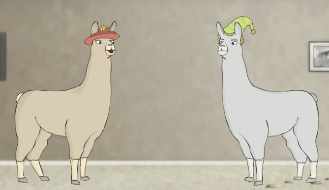

## It is not A.I.

Whenever possible, I try not to call it A.I. And I encourage other people to do the same. We should be careful with our language because particular terms and phrases hold powerful promise.

I use 'LLM,' for Large Language Model. That is what you are interacting with when you type messages to ChatGPT, Claude, Gemini, or any of the other chatbots people have wired up.

While I didn't like LLM, both spoke and being typed, Meta solved that for me. There must have been a vote inside Meta[^llama] and then decided to call them llamas. I will be joining them.

At Meta, the closer something is to Mark Zuckerberg, the worse it is. Their one contribution here, renaming large language models (LLMs) to llamas, is appreciated. If it really catches on it could kneecap the whole ‘Artificial Intelligence is here!’ movement, which would be good for humanity.

[^llama]: Meta released ollama as open source. It is a way to load and use large language models on your personal computing hardware.

<!-- next: history.html -->
